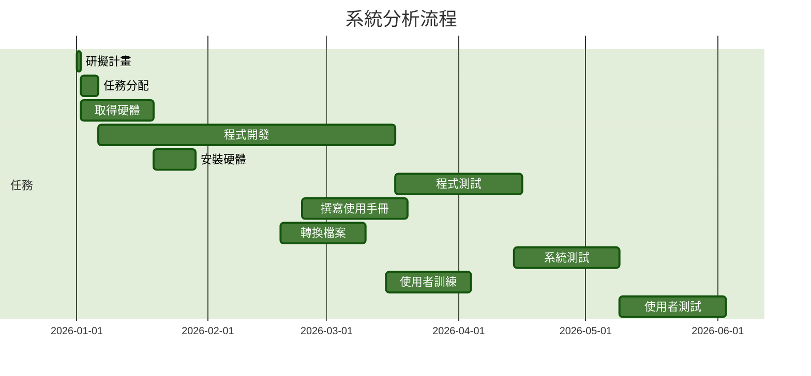

# PERT/CPM 圖

---
# 甘特圖

```mermaid

%%{init: {'theme':'forest'}}%%
gantt
    title 系統分析流程
    dateFormat  MM-DD
    section 任務
    研擬計畫 : a1, 01-01, 1d
    任務分配 : a2, 01-02, 4d
    取得硬體 : a3, 01-02, 17d
    程式開發 : a4, 01-06, 70d
    安裝硬體 : a5, 01-19, 10d
    程式測試 : a6, 03-17, 30d
    撰寫使用手冊 : a7, 02-23, 25d
    轉換檔案 : a8, 02-18, 20d
    系統測試 : a9, 04-14, 25d
    使用者訓練 : a10, 03-15, 20d
    使用者測試 : a11, 05-09, 25d

```
---
# 關鍵路徑
---

###### 你必須進行兩個步驟：(1) 顯示任務及任務模式，(2) 輸入開始及結束時間。
